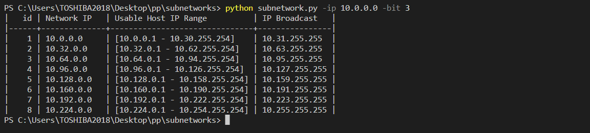

# SubNets

a command-line tool that enable you to find all the SubNetworks: Network IP Usable Host IP Range and IP Broadcast for each subnet.

## command line output


## export to a csv file


by default the name of file is SubNet, if you want to choose a different name just add it next to the export option. example

```bash
python subnetwork.py -ip 10.0.0.0 -bit 3 --export CustomisedName
```